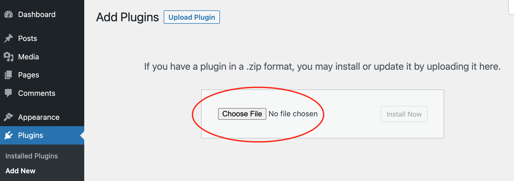
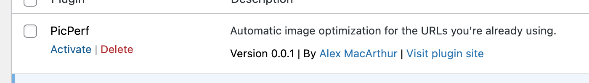

The official TypeIt WordPress plugin is a stupid-easy way to make your website's images faster, lighter, and more SEO-friendly.

## Getting Started

Before installing the plugin, you'll need to do the following:

### 1. Create an account.

In order to benefit from this plugin, you'll need to first create an account at [app.TypeIt.dev](https://app.TypeIt.dev/). You'll automatically be given a 14-day free trial, but in order keep your images optimized beyond that, upgrade to a regular plan.

### 2. Add your domain.

Add your website's domain inside the TypeIt dashboard. If your WordPress site runs on a different domain from your public website, you'll need to add both domains.

## Installation & Activation

After creating an account and adding a domain, [download the plugin here](/download/wordpress). Then, install it in the WordPress admin plugin page by uploading the .zip file you just downloaded.



After it's successfully installed, activate it.



## What It Does

Once it's activated, the plugin will automatically prefix every URL found in an image tag with the TypeIt host, allowing it to be optimized, reformatted, and cached.

In its curent version, it only impacts images loaded through WordPress's `the_content` filter. Because of this, you're highly encouraged to manually change image URLs outside this scope. For convenience, you may use the `TypeIt/transformUrl()` function available globally when the plugin is active:

```php
    $transformedUrl = TypeIt\transformUrl("https://example.com/my-image.jpg");

    // https://TypeIt.dev/https://example.com/my-image.jpg
```

## What If My Subscription is Cancelled?

If paused or cancelled, your images will remain to be prefixed as long as the plugin is active. However, you won't get any of the optimization benefit. Instead, your images will just pass through as if they're being served from your own site (with a little bit of extra latency, since they'll still be getting routed through TypeIt.dev). If you'd like to revert your images and stop using TypeIt, simply deactivate the plugin after removing any `TypeIt\transformUrl()` calls as described above.

## Changelog

- v0.0.1 - Initial verison is released.
- v0.1.0 - Add transformation support for images constructed through the `wp_get_attachment_image_attributes` filter.
- v0.2.0 - Add transformation support to featured images.
